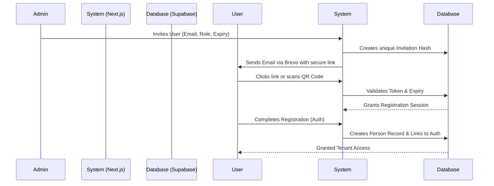

# HarvestGen People (Church OS)

People is a comprehensive, multi-tenant church member relationship management system built for Harvest Generation Church. It serves as the central source of truth for all member data, offering a secure, tenant-isolated environment. It seamlessly integrates with external connected systems—such as the Shepherd Learning Management System (LMS) and Drip & Brew Café Point-of-Sale (POS)—via a robust REST API authenticated by securely managed API keys.

**Tech Stack:** Next.js 14/15 (App Router), TypeScript, Tailwind CSS, shadcn/ui, Supabase (Postgres + Auth + Storage), Brevo (Transactional Email).

---

## 🏛️ System Architecture

HarvestGen People operates on a decoupled client-server model wrapped in a full-stack Next.js application, utilising Supabase for a heavily secured Backend-as-a-Service architecture.

### High-Level System Context

```mermaid
flowchart TD
    subgraph External Systems
        LMS[Shepherd LMS]
        POS[Drip & Brew Café POS]
    end

    subgraph "HarvestGen People (Church OS)"
        UI[Next.js App Router (Frontend)]
        API[Next.js Route Handlers (API v1)]
    end

    subgraph "Supabase Backend Infrastructure"
        DB[(Postgres SQL)]
        Auth[GoTrue Auth]
        Storage[Supabase Storage]
    end
    
    Email[Brevo SMTP Relay]

    LMS -- API Keys --> API
    POS -- API Keys --> API
    UI -- SSR / Server Actions --> DB
    UI -- Auth Tokens --> Auth
    API -- Server Client --> DB
    API -- Triggers Emails --> Email
    UI -- Uploads Proofs --> Storage
```

### Authentication & Invitation Flow

The platform relies on a strict, invite-only onboarding process to guarantee data security. 



---

## 🚀 Getting Started

### Prerequisites

Before you begin, ensure you have the following installed:
- [Node.js](https://nodejs.org/en/) (v20 or higher recommended)
- [Docker Desktop](https://www.docker.com/products/docker-desktop/) (must be running in the background)
- [Supabase CLI](https://supabase.com/docs/guides/cli/getting-started) (`brew install supabase/tap/supabase` on Mac)

### 1. Environment Setup

Copy the example environment file to create your local `.env` configuration files. Both `.env` and `.env.local` are used to ensure smooth Docker builds and Next.js development.

```bash
cp .env.example .env.local
cp .env.example .env
```

*Note: For email functionality (Invitations), you must provide `BREVO_SMTP_USER` and `BREVO_SMTP_KEY` in your environment files.*

### 2. Start the Local Supabase Infrastructure

Use the Supabase CLI to spin up the local database, auth services, and storage buckets via Docker:

```bash
supabase start
```
*This command will output your local API keys, Studio URL, and Postgres URL. Ensure the `NEXT_PUBLIC_SUPABASE_URL` and `NEXT_PUBLIC_SUPABASE_ANON_KEY` match the values generated in your `.env.local` file.*

### 3. Install Dependencies

```bash
npm install
```

### 4. Run the Development Server

To start the Next.js development server with Hot Module Replacement (HMR):

```bash
npm run dev
```

Open [http://localhost:3000](http://localhost:3000) in your browser.

---

## 🐳 Running Locally via Docker (Production Simulation)

To run the application exactly as it would behave in a production environment, we use a highly optimized, multi-stage Docker build.

1. **Build the Docker Image**
   This compiles the Next.js app and strips away unnecessary files (like the massive `node_modules` folder) to create a lightweight container.
   ```bash
   docker build -t people-hg .
   ```

2. **Run the Docker Container**
   ```bash
   docker run -p 3000:3000 people-hg
   ```
   The app will be available at [http://localhost:3000](http://localhost:3000).

> **Important Note on Environment Variables:** 
> Next.js "bakes" `NEXT_PUBLIC_` environment variables into the frontend bundle during the build step (`npm run build`). For local Docker testing, the `Dockerfile` automatically reads your local `.env` file so the container can connect to your local Supabase instance. When deploying to production (e.g., Vercel, AWS), you must configure the production environment variables in your hosting provider's dashboard before building.

---

## 🛡️ Testing & Verification

With Docker and the local Supabase stack running, execute the same release verification gate used by CI to ensure code health:

```bash
npm run verify
```

This runs:
- TypeScript type checking (`tsc --noEmit`)
- Code linting (`eslint`)
- Supabase schema linting and Postgres validation
- Node.js native Integration tests (Account Onboarding, People Lookup, Event Registration)
- A simulated Next.js production build

---

## 📖 Architecture Rules & Guidelines

When contributing to this project, please adhere to the rules established in:
- `SPEC.md`: Outlines the API endpoints, database schema, and design system.
- `GEMINI.md`: Core engineering rules for Supabase SSR, App Router conventions, and strict TypeScript usage.
- `AGENTS.md`: Outlines the specific roles (Architect, Backend, Frontend, DevOps) for maintaining separation of concerns in prompt-driven development.
